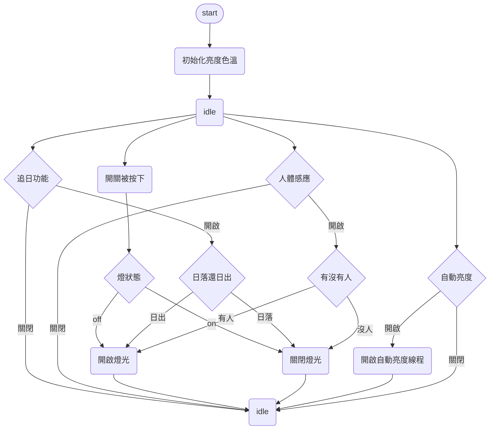

```mermaid
  graph TD 
    A([ start ]) -->l(初始化亮度色溫)-->B(idle)
    B --> c{追日功能}
    B --> d{人體感應}
    B --> e{自動亮度}
    B-->m(開關被按下)
    m-->i{燈狀態}-->|on|j
    i-->|off|h
    e-->|開啟|n(開啟自動亮度線程)
    c -->|開啟| g{日落還日出}-->|日出|h(開啟燈光)
    g-->|日落|j(關閉燈光)
    c -->|關閉| f(idle)
    d -->|關閉| f
    d-->|開啟|k{有沒有人}
    k-->|有人|h
    k-->|沒人|j
    h-->f
    j-->f
    n-->f
    e -->|關閉| f
    

```